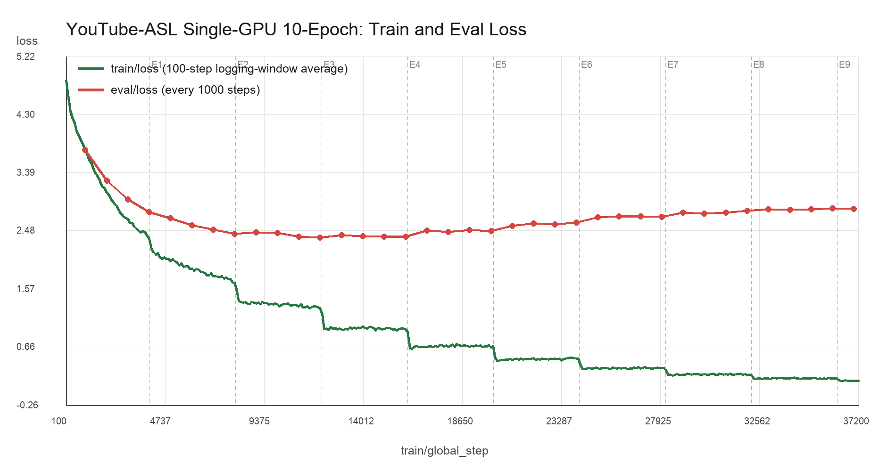
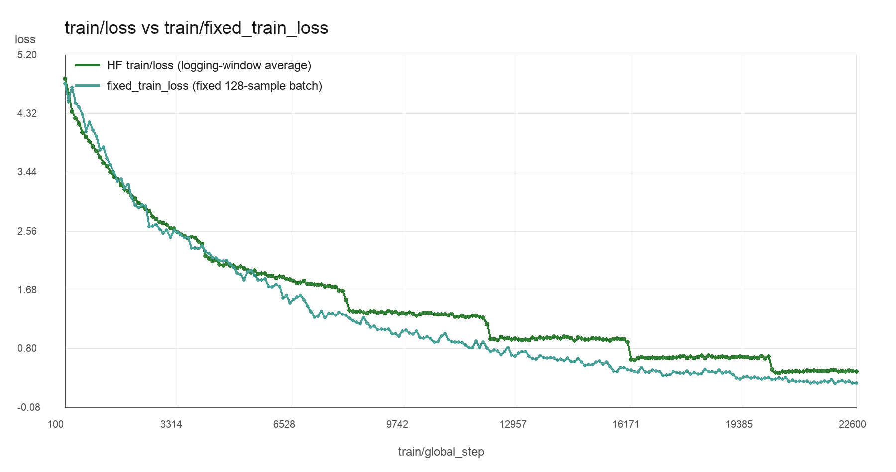

# YouTube-ASL Single-GPU 10-Epoch Experiment Record

## Scope

This document records the fresh single-GPU `YouTube-ASL` SignCLIP pretraining
run and its PopSign zero-shot checkpoint sweep.

The goal is to keep the run, checkpoints, W&B curves, and evaluation JSON files
easy to trace after later experiments are added.

## Pretraining Run

- W&B run name: `signclip-pretrain-youtube-asl-v3-10ep`
- W&B run: [pkeaq3xm](https://wandb.ai/xf-uzh-university-of-z-rich/multimodalhugs-signclip-youtube-asl/runs/pkeaq3xm)
- Config: `configs/signclip_pretrain_youtube_asl_10ep.server.yaml`
- Slurm script: `scripts/slurm/signclip_pretrain_youtube_asl_10ep.sh`
- Output root: `/home/faxu/scratch/signclip/runs/youtube_asl_pretrain_v3_10ep`
- Checkpoint root: `/home/faxu/scratch/signclip/runs/youtube_asl_pretrain_v3_10ep/train`
- Dataset setup: `/home/faxu/scratch/signclip/setup/youtube_asl_pretrain_v1/setup/datasets/default`
- Processor: `/home/faxu/scratch/signclip/setup/youtube_asl_pretrain_v1/setup/sign_clip_processor`

## Training Setup

- GPU: `1 x H100`
- Train batch size: `128`
- Eval batch size: `64`
- Epochs: `10`
- Learning rate: `5e-5`
- Scheduler: linear
- Warmup steps: `1000`
- Train-loss logging: every `100` steps
- Eval-loss logging: every `1000` steps
- Checkpoint saving: every epoch
- Maximum saved checkpoints: `10`

## Observed Training Pattern

Current qualitative observation from W&B:

- `train/loss` decreases strongly during training.
- `eval/loss` decreases early, then begins to flatten or worsen later.
- `train/loss` shows visible step-like drops around epoch boundaries.



The curves above were exported from W&B run `pkeaq3xm`. The training history
contains 372 `train/loss` points and 37 `eval/loss` points. The validation loss
reaches its lowest region around steps `12000`-`16000` and then trends upward
while training loss continues to decrease, providing direct evidence of
increasing overfitting after the early checkpoints.

The fixed-train-loss probe was created separately to diagnose whether the
epoch-boundary steps come from changing batches/statistics or real model-state
changes.



The fixed 128-sample train-loss curve is much smoother than the ordinary
`train/loss` curve logged by Hugging Face Trainer. This supports the current
interpretation that the visible epoch-boundary drops in `train/loss` are mainly
logging-window or batch-window statistics, rather than abrupt model-state
changes at epoch boundaries.

## PopSign Zero-Shot Evaluation

Evaluation target:

- PopSign setup dataset: `/home/faxu/scratch/signclip/setup/popsign_pretrain_v1/setup/datasets/default`
- Retrieval direction: `v2t`
- Metrics of interest: `v2t_r@1`, `v2t_r@5`, `v2t_r@10`, `v2t_median_r`, `eval_loss`

Checkpoint sweep script:

- `scripts/slurm/signclip_eval_popsign_zeroshot_youtube_asl_v3_10ep_sweep.sh`

Evaluation output root:

- `/home/faxu/scratch/signclip/evals/popsign_zeroshot_youtube_asl_v3_10ep_sweep`

Each checkpoint is evaluated into a separate subdirectory:

- `v3-10ep-checkpoint-<step>`

## Result Table

Local result files were collected under:

- `/Users/fanxu/research/asl-10epoch-popsing-eval`

| Checkpoint | v2t_r@1 | v2t_r@5 | v2t_r@10 | v2t_median_r | eval_loss | Notes |
|---|---:|---:|---:|---:|---:|---|
| checkpoint-4024 | 0.0510 | 0.1806 | 0.2763 | 33 | 4.8031 | epoch 1 |
| checkpoint-8048 | 0.1185 | 0.3207 | 0.4429 | 14 | 4.7618 | epoch 2 |
| checkpoint-12072 | 0.1070 | 0.2908 | 0.4100 | 17 | 4.9700 | epoch 3 |
| checkpoint-16096 | 0.1213 | 0.3265 | 0.4487 | 14 | 4.9687 | epoch 4; best R@1/5/10 |
| checkpoint-20120 | 0.1146 | 0.3003 | 0.4245 | 15 | 5.3559 | epoch 5 |
| checkpoint-24144 | 0.1158 | 0.3109 | 0.4333 | 14 | 5.4390 | epoch 6 |
| checkpoint-28168 | 0.1209 | 0.3080 | 0.4247 | 15 | 5.4549 | epoch 7 |
| checkpoint-32192 | 0.1014 | 0.2661 | 0.3823 | 19 | 5.7830 | epoch 8 |
| checkpoint-36216 | 0.1067 | 0.2776 | 0.3886 | 18 | 5.7330 | epoch 9 |
| checkpoint-40240 | TBD | TBD | TBD | TBD | TBD | epoch 10; local result file not found |

Current best checkpoint by PopSign v2t retrieval is `checkpoint-16096`.

## Useful Server Commands

List checkpoints:

```bash
CHECKPOINT_ROOT=/home/faxu/scratch/signclip/runs/youtube_asl_pretrain_v3_10ep/train
find "$CHECKPOINT_ROOT" -mindepth 1 -maxdepth 1 -type d -name 'checkpoint-*' -printf '%f\n' | sort -V
```

Find evaluation JSON files:

```bash
EVAL_ROOT=/home/faxu/scratch/signclip/evals/popsign_zeroshot_youtube_asl_v3_10ep_sweep
find "$EVAL_ROOT" -name eval_results.json -o -name all_results.json | sort -V
```

Print compact PopSign metrics from result files:

```bash
python - <<'PY'
import json
from pathlib import Path

root = Path("/home/faxu/scratch/signclip/evals/popsign_zeroshot_youtube_asl_v3_10ep_sweep")
for path in sorted(root.glob("v3-10ep-checkpoint-*/eval_results.json")):
    data = json.loads(path.read_text())
    print(
        path.parent.name,
        data.get("v2t_r@1"),
        data.get("v2t_r@5"),
        data.get("v2t_r@10"),
        data.get("v2t_median_r"),
    )
PY
```
